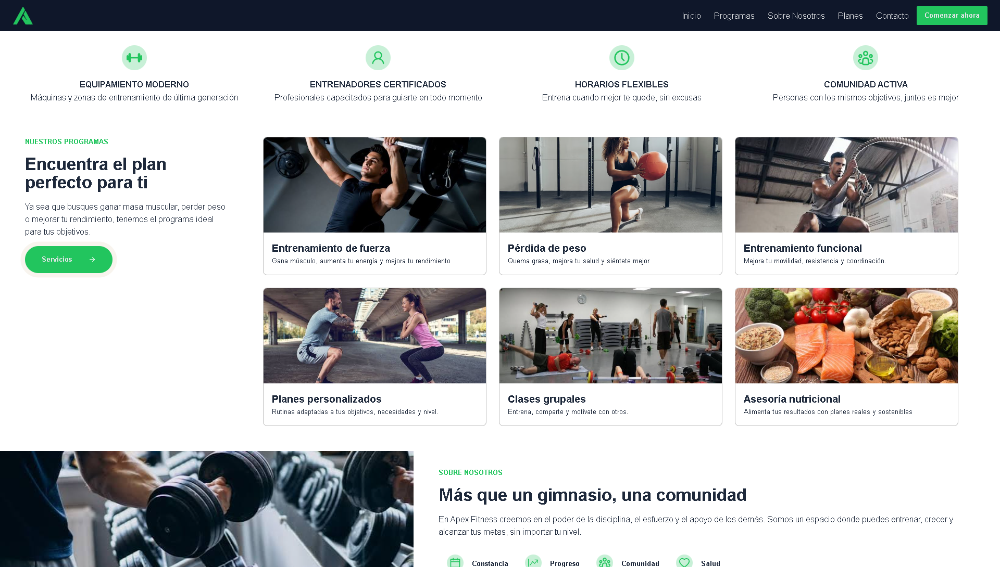

# Gym Website

A modern and responsive fitness website designed for a fictional gym brand, focused on presenting its services, facilities, programs, and brand identity through a strong and engaging frontend experience.

## Website

[View Website](https://dilandevlabs.github.io/gym-website/)

## Preview

  

## Overview

Apex Fitness is a frontend practice project built around a modern gym website. The design focuses on creating an energetic and professional experience while keeping the interface clear, structured, and easy to navigate.

The website is designed to guide visitors through the gym's services and encourage them to take action.

## Features

- Responsive layout
- Hero section with primary call-to-action
- Training programs
- Services and facilities
- Gym information
- Testimonials
- FAQ section
- Call-to-action sections
- Contact information
- Responsive navigation and footer

## Technologies

- HTML5
- CSS3
- JavaScript

## Design

The design follows a modern fitness-oriented visual style with a strong emphasis on:

- Bold typography
- Clear visual hierarchy
- Strong call-to-action elements
- Consistent spacing
- Responsive layouts
- User-focused navigation

## Purpose

This project was created to strengthen frontend development and UI/UX skills through the design and implementation of a complete business website.

It also serves as a portfolio project demonstrating the ability to translate a visual concept into a responsive and functional frontend.

## Status

Completed

## Author

Dilan Esteban
